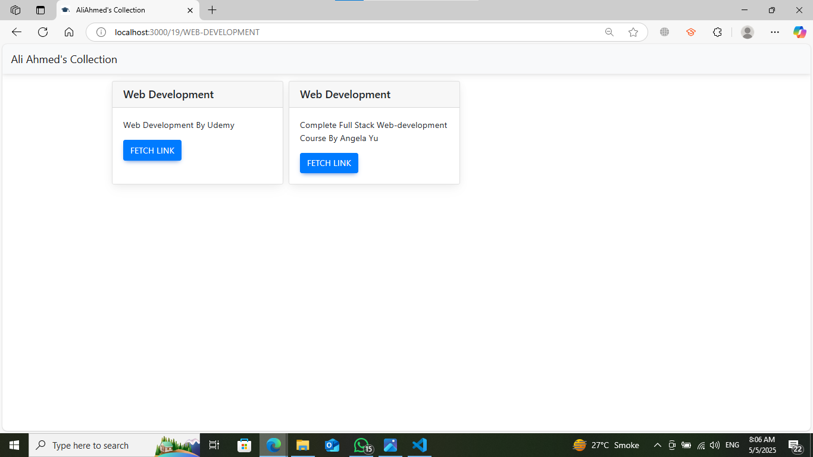

## paid-courses-collection
I have collected paid courses that may help someone.

## Installation
Clone the repository and install dependencies:
```bash
git clone https://github.com/Muhammad-Yaqoob-4110/paid-courses-collection.git
```
```
cd paid-courses-collection
```
```
npm install
```
Run the development server:
```
npm run
```
Then visit http://localhost:3000 in your browser.

## Contributing
Contributions are welcome! To contribute:
- Fork the repository.
- Make your changes.
- Commit and push.
- Create a pull request.


## How It Looks?



## License
This project is licensed under the [MIT License](LICENSE).